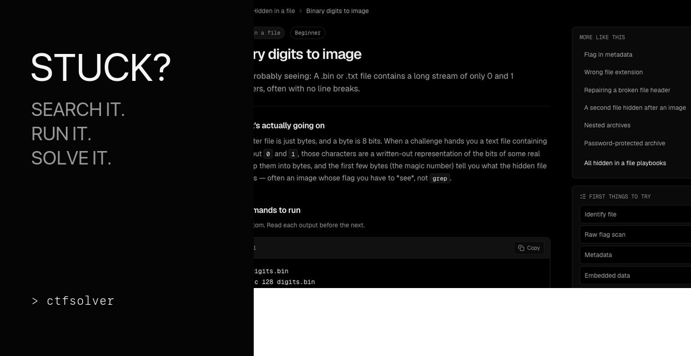
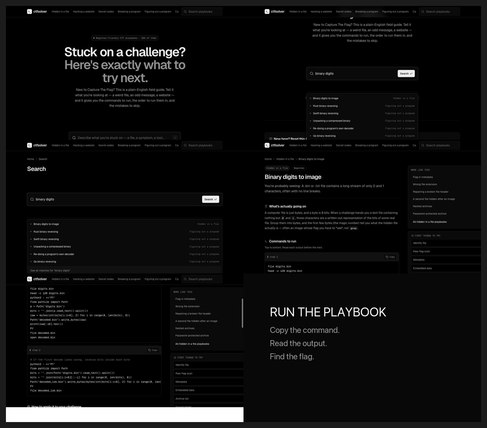

# ctfsolver

ctfsolver is a beginner-friendly field guide for Capture The Flag challenges. Instead of expecting someone to already know terms such as LSB steganography, SSTI, or ret2win, it lets them search for what they are actually seeing and turns that symptom into a practical playbook.

**Playable site:** [ctf-solver-web.vercel.app](https://ctf-solver-web.vercel.app)



## Why I Made It

When I was learning CTFs, the hardest part was often not running a command. It was knowing what the challenge was called and what to search for in the first place. Most references are written for people who already understand the jargon.

I made ctfsolver to close that gap. It starts with plain descriptions like "a file full of 1s and 0s" or "hidden information in a photo," teaches the proper technical name, and gives the learner a clear next action.

## What It Does

- Searches 264 playbooks by symptom, topic, alias, command, or tool
- Organizes challenges into eight plain-English categories
- Explains what is happening before presenting commands
- Provides copyable, ordered terminal commands
- Includes steps for applying each technique to a real challenge
- Shows worked examples and common mistakes
- Links related playbooks when the first approach is not enough
- Works on desktop and mobile

## How To Use It

1. Open the [playable site](https://ctf-solver-web.vercel.app).
2. Describe what you were given or what looks unusual. For example, search for `binary digits`, `metadata`, `JWT`, `PCAP`, or `QR`.
3. Choose the closest matching playbook from the suggestions or results.
4. Read the explanation so you understand what the technique is doing.
5. Run the commands from top to bottom, replacing example filenames and URLs with the ones from your challenge.
6. Read each command's output before moving to the next step.
7. Check the worked example and mistakes section if your result looks wrong.

Only use security techniques on CTFs, labs, or systems where you have permission.

## Demo

[Watch the demo video](assets/demo/ctfsolver-demo.mp4)

The demo searches for a file containing binary digits, opens the matching guide, reviews the explanation, and reaches the copyable commands.



## Run Locally

You need a current version of Node.js and npm.

```bash
git clone https://github.com/quantamShade0337/CTFSolverWeb.git
cd CTFSolverWeb
npm install
npm run dev
```

Open [http://127.0.0.1:5173](http://127.0.0.1:5173).

## Production Build

```bash
npm run build
npm run preview
```

The optimized site is written to `dist/`.

## Project Structure

```text
src/
  components/       Shared search, layout, guide, and command UI
  pages/            Home, category, search, and guide routes
  data.js           Core playbook data
  expandedGuides.js Additional playbook recipes
  details.js        Explanations and application steps
  friendly.js       Beginner-friendly names for technical concepts
scripts/
  qa.mjs            Desktop and mobile browser checks
  record-demo.mjs   Reproducible demo recording
assets/demo/        Screenshots, storyboard, thumbnail, and demo video
```

## Tech Stack

- React 19
- React Router
- Vite
- Lucide icons
- Playwright
- Vercel

## Refresh The Demo

Start the development server, then run:

```bash
node scripts/record-demo.mjs
ffmpeg -y -i assets/demo/ctfsolver-demo.webm \
  -c:v libx264 -pix_fmt yuv420p -movflags +faststart \
  assets/demo/ctfsolver-demo.mp4
```
